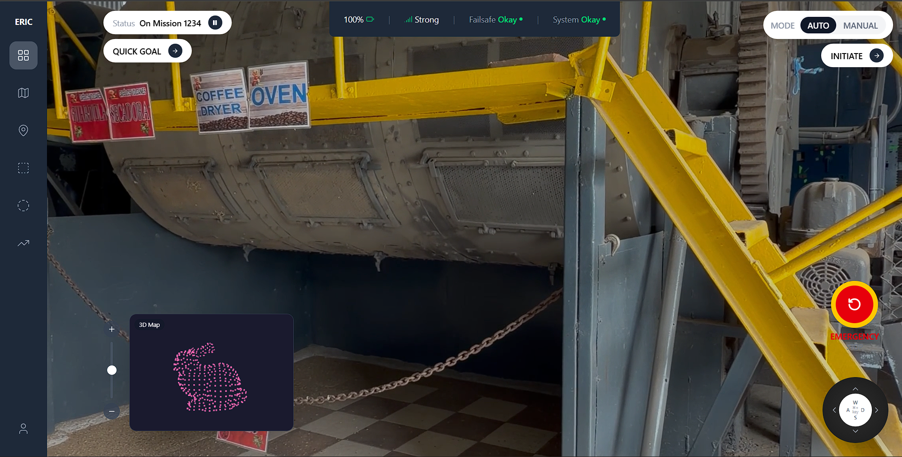

# Insight.IO Dashboard — ERIC Robotics Assignment

**Full Name:** Aditya Mote
**Contact:** +918320253859 
**Email:** adityamote478@gmail.com 

---

## Overview

A fully functional, self-hosted robot control dashboard built to match the Insight.IO design spec provided by ERIC Robotics. The dashboard provides real-time camera feed visualization, 3D point cloud map rendering, mission controls, and robot navigation inputs — all in a clean, modular React interface.

---

## Setup Instructions

### Prerequisites
- Node.js v18 or higher
- npm v9 or higher

### Installation

```bash
# 1. Clone the repository
git clone https://github.com/Rx-Metallica/Insight-Dashboard.git
cd insight-dashboard

# 2. Install dependencies
npm install

# 3. Start the development server
npm run dev

# 4. Open in browser
http://localhost:5173
```

> No internet connection required after `npm install`. All dependencies are local.

---

## Features

| Feature | Description |
|---|---|
| 📹 Camera Feed | Full-screen background video stream from warehouse camera |
| 🗺️ 3D Point Cloud Map | Interactive PCD file viewer using Three.js with orbit controls |
| 📊 Status Bar | Real-time battery, signal, failsafe, and system status indicators |
| 🎯 Mission Status | Current mission display with pause control |
| ⚡ Quick Goal | One-click goal assignment button |
| 🔁 Mode Toggle | Switch between AUTO and MANUAL robot operation modes |
| 🚀 Initiate | Mission initiation button |
| 🛑 Emergency Stop | Prominent emergency stop button with visual feedback |
| 🕹️ WASD Controller | Directional pad for manual robot navigation |
| 🔍 Zoom Slider | Vertical zoom control with +/- buttons |

---

## Tech Stack

| Tool | Version | Purpose |
|---|---|---|
| React | 18.3.1 | Frontend framework |
| Vite | 5.4.10 | Build tool and dev server |
| Tailwind CSS | 4.2.1 | Utility-first styling |
| Lucide React | 0.577.0 | Icon library |
| Three.js | 0.183.2 | 3D point cloud rendering |

---

## Project Structure

```
src/
  components/
    Sidebar.jsx          # Navigation sidebar with lucide icons
    StatusBar.jsx        # Top center status indicators
    MissionStatus.jsx    # Mission status + Quick Goal button
    ModeToggle.jsx       # AUTO/MANUAL toggle + Initiate button
    CameraView.jsx       # Full-screen video background
    MapView.jsx          # 3D PCD viewer + camera view toggle
    EmergencyStop.jsx    # Emergency stop button
    WASDController.jsx   # Directional control pad
    ZoomSlider.jsx       # Vertical zoom slider
  App.jsx                # Root layout
  main.jsx               # Entry point

public/
  videos/
    feed.mp4             # Camera feed video
  pointcloud/
    bunny.pcd            # Sample point cloud data
```

---

## Architecture Decisions

### Component-Based Structure
Each UI element is its own isolated component, making the codebase easy to maintain, test, and extend. Components communicate via props rather than global state.

### Shared View State
The camera/map toggle state is lifted to `App.jsx` and passed down as props to both `CameraView` and `MapView`. This ensures both components always stay in sync — when one shows video, the other shows 3D and vice versa.

### Three.js Integration
The 3D point cloud viewer is implemented directly in React using `useRef` and `useEffect` for DOM mounting. A `setTimeout` delay ensures the DOM is fully ready before Three.js initializes, preventing black screen issues.

### Static Files for Demo
Camera feed uses a local MP4 file and the 3D map uses a `.pcd` point cloud file, both served from the `public/` directory. This allows the dashboard to run fully offline without any external dependencies.

---

## Bonus Features Implemented

- ✅ **Modular code structure** — every component is self-contained
- ✅ **Smooth transitions** — hover states and active animations on all buttons
- ✅ **WASD press animation** — buttons flash on click with auto-reset
- ✅ **Progressive commit history** — each feature committed separately

---

## Screenshots

> 

---

## Known Limitations

- Camera feed uses a static video file instead of a live ROS stream
- Point cloud uses a sample `.pcd` file instead of live LiDAR data
- ROS integration would require `roslibjs` and a running ROS2 bridge

---